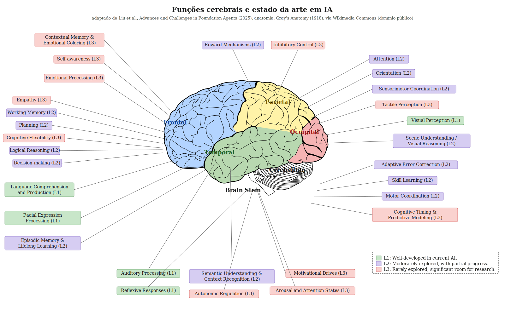

# Sistemas Multi-Agentes na Natureza

<p align="center">
  
</p>

> *Adaptado da Figura 1 de Liu et al., **Advances and Challenges in Foundation Agents** (2025). Cores indicam o estado da arte em IA: verde (L1) bem desenvolvido, roxo (L2) parcial, vermelho (L3) gap aberto.*

---

## A tese

Nada é criado, tudo é copiado. A natureza já resolveu, sob pressão evolutiva, vários problemas de coordenação entre agentes que a inteligência artificial multi-agente está hoje tentando resolver. O cérebro humano é um desses sistemas — talvez o mais sofisticado — mas não é o único. Colônias de abelhas, formigueiros, cardumes, sistemas imunes, organizações humanas hierárquicas, squads ágeis: cada um resolveu, à sua maneira, problemas concretos de coordenação, alocação, consenso, memória distribuída e resposta a anomalia.

Este estudo cataloga essas soluções biológicas e mapeia, capítulo a capítulo, contra arquiteturas de IA contemporâneas. O objetivo é tratar a natureza como **catálogo de referência arquitetural**, não como metáfora. Quando se escolhe entre supervisor centralizado e topologia em rede, entre agentes homogêneos e heterogêneos, entre comunicação direta e mediada pelo ambiente, está-se reescolhendo entre opções que a evolução já testou.

A imagem de abertura é o ponto de partida — adaptada do paper que originou este trabalho, mostra o cérebro humano com semáforo de maturidade em IA aplicada. É também o capítulo 05 deste estudo. Os outros oito capítulos cobrem os demais arquétipos.

---

## Por onde começar

- **[00 — Tese](./00-tese.md).** Define o que é o estudo, o que não é, e como se organiza.
- **[AGENTS.md](./AGENTS.md).** Documento orientado a agentes de IA que abrirem o repositório.

---

## Estrutura

```
biomimetica/
├── README.md                ← esta página
├── cerebro.svg              ← imagem de abertura
├── 00-tese.md               ← capítulo zero
├── 01-colonia-abelhas.md    ← um capítulo por sistema natural
├── ...
├── 09-seguranca.md
├── primitivas/              ← dicionário de tradução
└── projetos/                ← aplicação em projetos próprios
```

Cada capítulo segue o mesmo template: biologia → problema resolvido → primitivas envolvidas → mapeamento em IA → status → aplicação → referências.

---

## Capítulos

| Nº | Sistema natural |
|----|-----------------|
| 00 | Tese |
| 01 | Colônia de abelhas |
| 02 | Formigueiro |
| 03 | Cardume e bando |
| 04 | Cupinzeiro |
| 05 | Cérebro humano |
| 06 | Sistema imune |
| 07 | Empresa hierárquica e squad ágil |
| 08 | Sono e consolidação |
| 09 | Segurança e ataques |

## Convenções de status

- 🟢 **Verde** — primitiva ou problema resolvido em IA aplicada hoje.
- 🟡 **Amarelo** — parcialmente resolvido, área ativa de pesquisa.
- ⚪ **Cinza** — gap aberto. A natureza resolveu, IA ainda não.

---

## Método

Este estudo é construído em parceria explícita entre humano e IA. A IA atua como bibliotecário e revisor — busca, organiza referências, sintetiza literatura, propõe estruturas, sinaliza inconsistências. O humano atua como sintetizador e decisor — define escopo, escolhe o que entra, conecta com projetos próprios, mantém a tese viva.

O formato é integralmente em markdown. Não é estética — é funcional. Markdown é o formato que IAs contemporâneas leem e escrevem com fidelidade alta, é versionável em Git, e degrada bem em qualquer leitor.

---

## Licença

[CC BY 4.0](https://creativecommons.org/licenses/by/4.0/). Conteúdo aberto, atribuição obrigatória, derivados permitidos.
